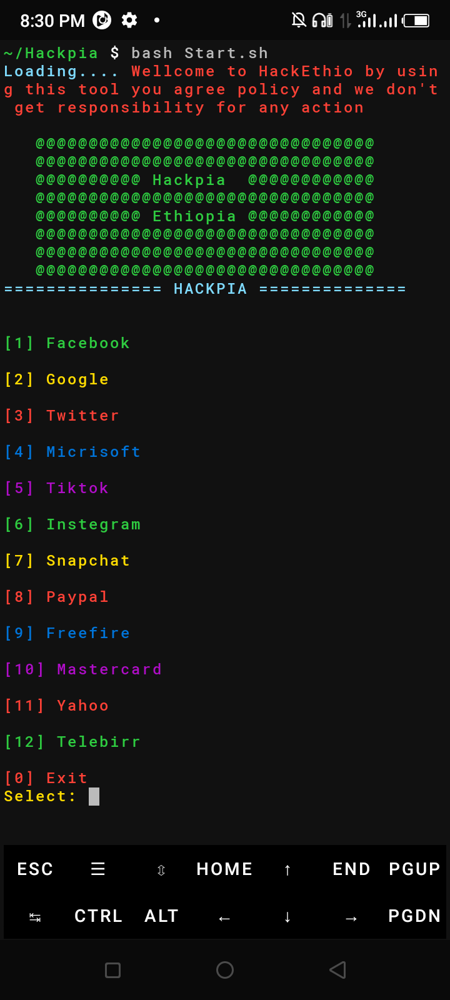

<h2>Hackpia🇪🇹</h2> is simple and easy phishing tool .
you don't need complex process such as server side program
instead just you need to install requirements
then you can select any of provided templates then
you will get url and send it to your victim
Below screenshot shows you about hackpia interface 👇

  

